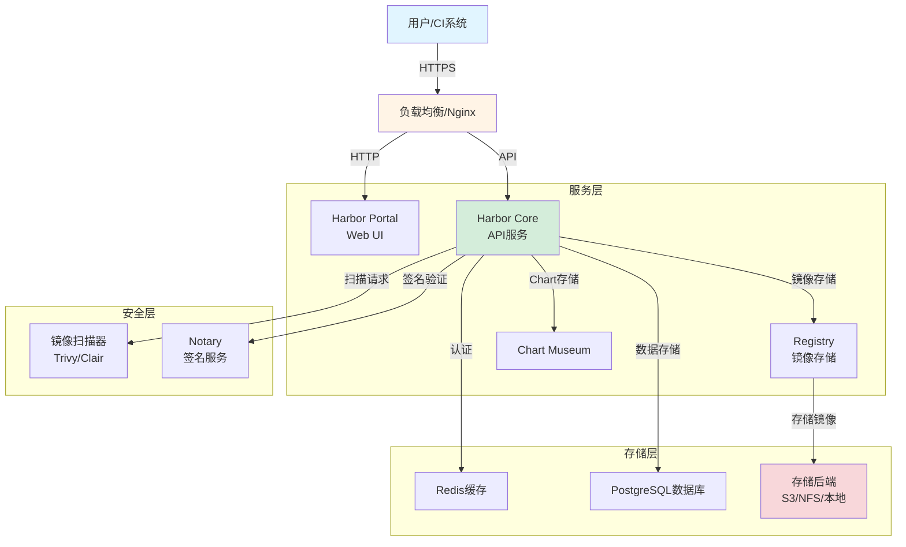

Harbor 是企业级容器镜像仓库解决方案，提供镜像管理、安全扫描、访问控制等核心功能。本指南涵盖生产环境部署、高可用配置、安全加固、性能优化和运维管理等全流程内容，适用于构建安全可靠的容器镜像管理平台。

<!-- more -->

**适用版本与环境说明：**
- Harbor: 2.10.x（本文以 v2.10.3 为示例）
- Docker: 20.10.x 及以上版本
- Docker Compose: 2.x 及以上版本
- PostgreSQL: 内置版本（Harbor 2.10.x 内置 PG 13.x）
- Redis: 内置版本
- 操作系统: Ubuntu 20.04+/Debian 11+/CentOS 7.9+
- 存储: 建议使用 SSD，最低 100GB
- 更新日期: 2025-01-13（建议关注 Harbor GitHub Releases）


Harbor 版本更新频繁，部署前请访问 [Harbor Releases](https://github.com/goharbor/harbor/releases) 确认最新稳定版本。不同版本组件依赖可能有所差异。


## Harbor 架构概述

## Harbor 架构概述

### 核心组件

| 组件 | 功能 | 生产要求 |
|------|------|----------|
| Harbor Core | 核心API服务 | 2副本+负载均衡 |
| Harbor Portal | Web UI界面 | 与Core同部署 |
| Registry | 镇像存储服务 | 高可用存储后端 |
| Chart Museum | Helm Chart仓库 | 可选组件 |
| Clair/Trivy | 镜像扫描服务 | 独立部署 |
| Notary | 镇像签名服务 | 可选，生产推荐 |
| Redis | 缓存服务 | Sentinel高可用 |
| PostgreSQL | 数据库服务 | 主从复制 |

### 架构可视化



**架构说明：**

1. **外部访问层**：用户通过 HTTPS 访问 Harbor，Nginx 负载均衡分发请求
2. **服务层**：Harbor Core 提供核心 API，Portal 提供 Web UI，Registry 存储镜像
3. **安全层**：Scanner 执行镜像漏洞扫描，Notary 提供镜像签名验证
4. **存储层**：PostgreSQL 存储元数据，Redis 缓存会话，S3/NFS 存储镜像文件

### 存储架构

Harbor支持多种存储后端：
- **本地文件系统**：简单部署，适合小规模
- **NFS**：多实例共享存储
- **S3/Swift**：对象存储，云环境推荐
- **Ceph**：分布式存储，企业级应用

## 基础部署配置

### 前提条件

1. 系统要求：
   - CPU: 4核心及以上
   - 内存: 8GB及以上
   - 磁盘: 100GB及以上(建议SSD)
   - 网络: 100Mbps及以上
   
2. 环境要求：
   - Docker 20.10.x及以上
   - Docker Compose 2.x及以上
   - 服务器端口要求：
     - HTTP: 80(默认)
     - HTTPS: 443(默认)
     - 确保以上端口未被占用

### 安装配置

1. 下载并解压Harbor：
```bash
# 下载离线安装包
wget https://github.com/goharbor/harbor/releases/download/v2.10.3/harbor-offline-installer-v2.10.3.tgz

# 解压文件
tar xf harbor-offline-installer-v2.10.3.tgz
cd harbor/

# 导入镜像
docker load -i harbor.v2.10.3.tar.gz
```

2. 配置Harbor：
```bash
# 复制配置模板
cp harbor.yml.tmpl harbor.yml

# 修改配置文件
cat > harbor.yml << EOF
hostname: harbor.example.com  # 修改为实际域名
http:
  port: 80
data_volume: /data/harbor/data
harbor_admin_password: Harbor12345  # 修改默认密码
database:
  password: root123
  max_idle_conns: 100
  max_open_conns: 900
storage_service:
  ca_bundle: /etc/docker/certs.d/harbor.example.com/ca.crt
  token_service:
    issuer: harbor-token-issuer
    expiration: 30
log:
  level: info
  local:
    rotate_count: 50
    rotate_size: 200M
    location: /data/harbor/logs
EOF
```

3. 准备安装环境：
```bash
# 创建必要目录
mkdir -p /data/harbor/{data,logs,cert}
chmod 755 /data/harbor/logs

# 执行准备脚本
./prepare
```

4. 启动Harbor：
```bash
# 安装Harbor
./install.sh

# 验证安装
docker compose ps
```

## 系统配置

### 基础配置

1. 配置域名解析：
```bash
# 添加hosts记录
echo "192.168.x.x harbor.example.com" >> /etc/hosts

# 验证解析
ping harbor.example.com
```

2. 登录验证：
```bash
# 使用默认账号登录
docker login harbor.example.com -u admin -p Harbor12345
```

### 安全配置

#### TLS证书配置（生产必需）

生成自签名证书（测试环境）：
```bash
mkdir -p /data/harbor/cert
openssl req -newkey rsa:4096 -nodes -sha256 -keyout /data/harbor/cert/harbor.key \
  -x509 -days 365 -out /data/harbor/cert/harbor.crt \
  -subj "/C=CN/ST=Shanghai/L=Shanghai/O=DevOps/CN=harbor.example.com"

# 添加到Docker信任列表
mkdir -p /etc/docker/certs.d/harbor.example.com
cp /data/harbor/cert/harbor.crt /etc/docker/certs.d/harbor.example.com/ca.crt
```

使用企业CA证书（生产环境）：
```bash
# 将CA证书和服务器证书放入指定目录
cp harbor-ca.crt /etc/docker/certs.d/harbor.example.com/ca.crt
cp harbor-server.crt /data/harbor/cert/harbor.crt
cp harbor-server.key /data/harbor/cert/harbor.key

# 配置harbor.yml
hostname: harbor.example.com
http:
  port: 80
https:
  port: 443
  certificate: /data/harbor/cert/harbor.crt
  private_key: /data/harbor/cert/harbor.key
```

#### 1. 创建机器人账户：
```yaml
robot_account:
  name: jenkins
  description: "Jenkins CI/CD Integration"
  permissions:
    - project: "*"
      access:
        - pull
        - push
        - delete
  expiration: never
```

2. 配置用户角色：
```text
系统角色设置：
- 管理员(admin): 系统管理权限
- 开发者(developer): 项目级别管理权限
- 访客(guest): 只读权限
```

### 仓库管理

1. 仓库策略配置：
```yaml
repository_policy:
  project_quota: 20GB
  retention_policy:
    number_of_tags: 5
    retention_days: 30
  tag_immutability: true
  auto_scan: true
  vulnerability_scan:
    enabled: true
    scan_schedule: "0 0 * * *"
```

2. 镜像清理策略：
```yaml
garbage_collection:
  schedule: "0 2 * * *"
  delete_untagged: true
  dry_run: false
```

## 高级特性配置

### 复制规则配置

1. 跨数据中心复制：
```yaml
replication_policy:
  name: "dc-sync"
  src_registry:
    url: "https://harbor-dc1.example.com"
    credential:
      type: "secret"
      value: "xxxxxx"
  dest_registry:
    url: "https://harbor-dc2.example.com"
    credential:
      type: "secret"
      value: "xxxxxx"
  filters:
    - type: "name"
      value: "project/**"
    - type: "tag"
      value: "prod-*"
  trigger:
    type: "scheduled"
    settings:
      cron: "0 0 * * *"
```

2. 镜像同步策略：
```yaml
sync_policy:
  deletion: true
  override: true
  namespaces:
    - source: "project-a"
      destination: "project-b"
  filters:
    repository:
      - "nginx/**"
      - "mysql/**"
    tag:
      - "v*"
      - "latest"
```

### 存储后端配置

1. S3存储配置：
```yaml
storage:
  type: "s3"
  s3:
    region: "us-east-1"
    bucket: "harbor-storage"
    access_key: "YOUR_ACCESS_KEY"
    secret_key: "YOUR_SECRET_KEY"
    root_directory: "/harbor"
    chunk_size: 5242880
```

2. Swift存储配置：
```yaml
storage:
  type: "swift"
  swift:
    username: "admin"
    password: "password"
    auth_url: "https://keystone.example.com/v3"
    container: "harbor"
    region: "RegionOne"
```

### LDAP/AD集成

1. 基础配置：
```yaml
auth_mode: "ldap_auth"
ldap_url: "ldap://openldap.example.com"
ldap_base_dn: "dc=example,dc=com"
ldap_search_dn: "cn=admin,dc=example,dc=com"
ldap_search_password: "password"
ldap_filter: "(&(objectClass=person)(uid=%s))"
ldap_uid: "uid"
ldap_scope: 2
ldap_timeout: 5
```

2. 高级同步配置：
```yaml
ldap_group_sync:
  enabled: true
  cron: "0 0 * * *"
  group_base_dn: "ou=groups,dc=example,dc=com"
  group_filter: "(&(objectClass=groupOfNames))"
  group_name_attr: "cn"
  group_member_attr: "member"
```

## 企业级特性

### 多集群管理

1. Proxy Cache配置：
```yaml
proxy_cache:
  enabled: true
  endpoints:
    - name: "dockerhub"
      url: "https://registry-1.docker.io"
      username: "username"
      password: "password"
      patterns:
        - "library/*"
        - "bitnami/*"
```

2. P2P分发配置：
```yaml
p2p_distribution:
  enabled: true
  tracker_endpoints:
    - "udp://tracker1.example.com:6969"
    - "udp://tracker2.example.com:6969"
  seeder_config:
    concurrent_tasks: 5
    seed_ratio: 1.5
    bandwidth_limit: "100M"
```

### 容器运行时安全

1. 镜像签名验证：
```yaml
signature_verification:
  enabled: true
  providers:
    - name: "notary"
      endpoint: "https://notary.example.com"
      root_cert: "/path/to/root-ca.crt"
    - name: "cosign"
      public_key: "/path/to/cosign.pub"
```

2. 镜像扫描策略：
```yaml
security_scan:
  scanners:
    - name: "trivy"
      adapter_url: "http://trivy:8080"
      priority: 1
    - name: "clair"
      adapter_url: "http://clair:6060"
      priority: 2
  scan_policy:
    severity_threshold: "High"
    whitelist_expiration: 7d
    fail_on_findings: true
```

## 运维管理

### 备份策略

1. 数据备份脚本：
```bash
#!/bin/bash
BACKUP_DIR="/backup/harbor"
DATE=$(date +%Y%m%d)

# 创建备份目录
mkdir -p ${BACKUP_DIR}/${DATE}

# 停止Harbor服务
docker compose down

# 备份数据
tar czf ${BACKUP_DIR}/${DATE}/harbor_data.tar.gz /data/harbor/

# 备份数据库
docker compose up -d postgresql
docker exec harbor-db pg_dump -U postgres registry > ${BACKUP_DIR}/${DATE}/registry.sql

# 启动Harbor服务
docker compose up -d
```

### 监控配置

1. Prometheus集成：
```yaml
global:
  scrape_interval: 15s
  evaluation_interval: 15s

scrape_configs:
  - job_name: 'harbor'
    static_configs:
      - targets: ['harbor.example.com']
    metrics_path: '/metrics'
```

2. 告警规则：
```yaml
groups:
- name: harbor_alerts
  rules:
  - alert: HarborHighMemoryUsage
    expr: container_memory_usage_bytes{container_name=~"harbor-.*"} > 1e9
    for: 5m
    labels:
      severity: warning
    annotations:
      summary: "Harbor container high memory usage"
```

## 最佳实践

### 安全建议

1. 系统安全：
   - 使用HTTPS访问
   - 启用镜像签名
   - 配置漏洞扫描
   - 实施访问控制

2. 运维安全：
   - 定期更新版本
   - 监控系统资源
   - 配置自动备份
   - 实施灾备方案

### 性能优化

1. 系统优化：
   - 使用SSD存储
   - 配置合适的GC策略
   - 优化数据库连接池
   - 实施镜像分层策略

2. 网络优化：
   - 配置负载均衡
   - 启用P2P分发
   - 优化代理缓存
   - 配置服务网格

## 总结

Harbor是一个企业级容器镜像仓库平台，通过合理配置和优化，可以为团队提供安全可靠的镜像管理服务。本文档涵盖了从基础部署到企业级特性的完整配置指南，建议根据实际需求选择性地启用功能，并持续关注系统的性能和安全性。