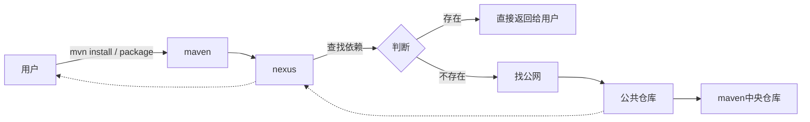

&nbsp;&nbsp;&nbsp;&nbsp;&nbsp;&nbsp; Maven私有仓库(Nexus)是企业进行依赖管理的重要基础设施。然而在实际使用中,团队常常因配置混乱导致跨团队协作困难,依赖问题频发。比如本地构建或打包时出现异常,公有云仓库与私有仓库混用导致缓存失效,这些都增加了不必要的沟通与排查成本。为此,我们需要统一规范配置,明确依赖管理流程,包括拉取依赖、上传私有包等标准操作方式。通过规范化管理,不仅可以方便项目交接和新人上手,还能充分发挥私有仓库的缓存加速作用,提升团队整体开发效率。本文将详细介绍Maven私有仓库的最佳实践,帮助团队建立起高效的依赖管理体系。

<!-- more -->

## 修改Maven配置

### 修改settings配置

私有仓库Nexus信息示例:

- Nexus服务地址: `http://nexus.your-company.com:8081/`
- 开发者账号: `developer/your-password`
- Maven公共仓库地址: `http://nexus.your-company.com:8081/repository/maven-public/`
- Maven私有包-稳定版本-上传地址: `http://nexus.your-company.com:8081/repository/maven-releases/`
- Maven私有包-开发版本-上传地址: `http://nexus.your-company.com:8081/repository/maven-snapshots/`

需要修改settings.xml配置文件,使其完全通过企业内网Nexus访问依赖,而不是直接访问公网仓库。这样可以:

1. 首次使用时,Nexus会从公网拉取并缓存依赖
2. 后续使用时直接从Nexus获取缓存的依赖,加快构建速度
3. 统一管理团队使用的依赖版本

settings.xml示例配置:

```xml
<settings>
  <mirrors>
    <mirror>
      <id>nexus</id>
      <mirrorOf>*</mirrorOf>
      <url>http://nexus.your-company.com:8081/repository/maven-public/</url>
    </mirror>
  </mirrors>

  <servers>
    <server>
      <id>maven-releases</id>
      <username>${NEXUS_USERNAME}</username>
      <password>${NEXUS_PASSWORD}</password>
    </server>
    <server>
      <id>maven-snapshots</id>
      <username>${NEXUS_USERNAME}</username>
      <password>${NEXUS_PASSWORD}</password>
    </server>
  </servers>
</settings>
```

#### 公网包支持

如果在使用内网Maven公共仓库时无法拉取某些公网依赖包:

1. 可以联系Nexus管理员添加所需的公网仓库源
2. 默认应该已配置了主流公共仓库(如Maven中央仓库、阿里云Maven仓库等)
3. 如需添加其他冷门仓库源,请提供仓库地址给管理员统一配置

#### 内网私有包支持

如果无法拉取内网私有包:

1. 优先联系包的开发团队,确认是否已上传到私有仓库
2. 如未上传,请开发团队先完成上传

上传私有包到releases仓库:
1. 通过Nexus Web UI上传
2. 选择 `hosted` 类型的仓库才能上传成功

#### 批量上传包到私库

对于需要批量上传的场景:

1. 可以使用maven-deploy插件上传:

```shell
mvn deploy:deploy-file \
    -Durl=http://nexus.your-company.com:8081/repository/maven-snapshots \
    -DrepositoryId=snapshots \
    -Dfile=your-artifact.jar \
    -DgroupId=com.company \
    -DartifactId=project \
    -Dversion=1.0-SNAPSHOT \
    -Dpackaging=jar
```

2. 也可以使用批量上传工具,如阿里云云效的 `migrate-local-repo-tool.jar`

### 修改父POM配置

在项目顶级pom.xml中配置仓库信息:

```xml
<project>
    <repositories>
        <repository>
            <id>maven-public</id>
            <name>maven-public</name>
            <url>http://nexus.your-company.com:8081/repository/maven-public/</url>
            <releases>
                <enabled>true</enabled>
            </releases>
            <snapshots>
                <enabled>true</enabled>
            </snapshots>
        </repository>
    </repositories>

    <distributionManagement>
        <repository>
            <id>maven-releases</id>
            <name>maven-releases</name>
            <url>http://nexus.your-company.com:8081/repository/maven-releases/</url>
        </repository>
        <snapshotRepository>
            <id>maven-snapshots</id>
            <name>maven-snapshots</name>
            <url>http://nexus.your-company.com:8081/repository/maven-snapshots/</url>
        </snapshotRepository>
    </distributionManagement>
</project>
```

### Nexus仓库说明

Nexus作为仓库管理工具的主要功能:




#### Maven公共仓库

- 用途:存储公共依赖包
- 特点:自动从公网仓库同步和缓存
- 应用:主要用于依赖解析和下载

#### Maven Releases仓库 

- 用途:存储稳定版本构件
- 特点:不可变性,版本唯一
- 应用:正式发布版本管理

#### Maven Snapshots仓库

- 用途:存储开发版本构件
- 特点:可覆盖更新,版本号带-SNAPSHOT后缀
- 应用:开发阶段使用

#### 使用建议

1. 严格遵循版本命名规范
2. 合理配置权限管理
3. 正确配置pom.xml和settings.xml
4. 确保网络环境正常访问

